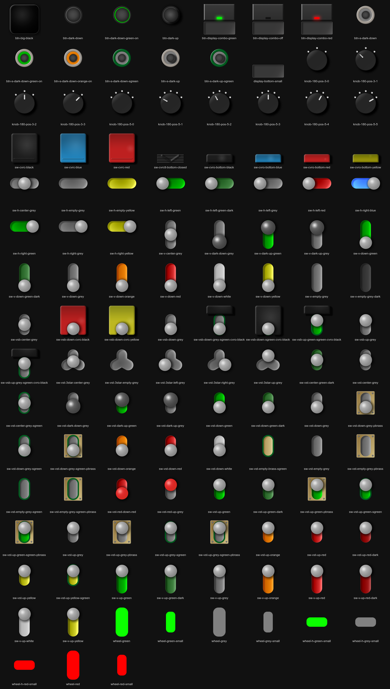
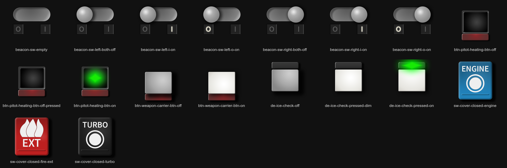
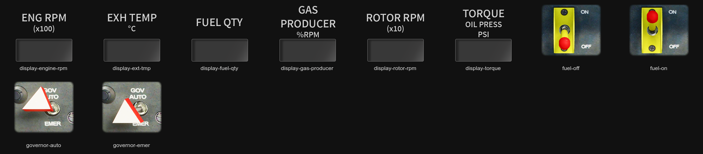

= Custom Touch Portal Icons

== Naming conventions

* *sw-v-center-grey* means it's a vertical (*v*) switch in a *center* position with a grey travel section
* *sw-v-dark-up-green* is similar, but the switch knob (not specified above) is "dark" (and a bit larger)
and the travel is green (kind of highlight)
* *sw-vst-empty-brass-sgreen* is vertical short switch positioned at the top of the icon (*vst*) to make room
for a label below, it is *empty* (no knob), brass travel highlight and an additional green stroke around (*sgreen*)
* *sw-h-left-grey* is a horizontal switch (*h*), this is always position towards the top of the icon (a lot of
room for a label), grey travel and normal knob positioned *left*
* various buttons are also mostly positioned towards the top to make room for a label

== Properties notes

Vertical switches - transform W/H, X/Y:

* travel (long): 80/220, 88/18
* travel (short up): 80/160, 88/18
* custom stroke has the same transform properties as the travel
* knob: 95/95, 81/... (up..center..down: long 18..81..143, short-up 18..51..83)
* knob dark (bigger): 110/110, 73/... (up..center..down: long 18..?..128)

== Image index

Common icons:

[link=index-common.png]

L-39 icons:

[link=index-l-39.png]

UH-1H icons:

[link=index-uh-1h.png]

== How to generate the index images

Note for myself:

----
magick montage -label '%t' common/*.png -tile 8x -geometry 128x128+30+10 -background '#111111' -fill '#ddd' index-common.png
magick montage -label '%t' l-39/*.png -tile 8x -geometry 128x128+30+10 -background '#111111' -fill '#ddd' index-l-39.png
magick montage -label '%t' uh-1h/*.png -tile 8x -geometry 128x128+30+10 -background '#111111' -fill '#ddd' index-uh-1h.png
----

* `-label` must appear before the list of files (e.g. `*.png`), otherwise no labels are generated,
* `-tile 8x` means 8 columns, `x4` would mean 4 rows,
* `-geometry XxY+A+B` is size X (width), Y (height), horizontal (A) and vertical (B) spacing,
* `-backround` is bg color, can be also `none` to keep the transparency of the icons in the final index,
* `-fill` is the color of the labels.
