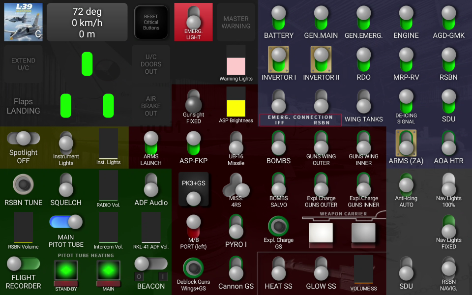

= L-39 Touch Portal panel

* Pages to import: https://github.com/virgo47/dcs-files/raw/main/touch-portal-panels/pages/dcs-l39-pages.tpz2[dcs-l39-pages.tpz2]

Remote links:

* DCS user file: https://www.digitalcombatsimulator.com/en/files/3336442/[DCS-COINS: L-39C/ZA Dashboard]
// TODO
* Forum comment: https://forum.dcs.world/topic/207264-touch-portal-app/page/16/#comment-5403433

Main page:

Alt page (click on the heading/speed/altitude display):

== User file info

* Name: +
DCS-COINS: L-39C/ZA Dashboard

* Summary:
+
....
Two-page control "panel" for Touch Portal Android application, powered by DCS-COINS plugin.
Contains the Main page for most occasions and the Alt page for startup/engine/emergency/checks.
....

* Description:
+
....
License/conditions:
- The dashboard itself and original icons are distributed under Unlicense: https://en.wikipedia.org/wiki/Unlicense

Requirements:
- DCS-COINS: https://www.digitalcombatsimulator.com/en/files/3319022/
- Touch Portal 4.3: https://www.touch-portal.com/
- Touch Portal on Android requires a paid Pro Upgrade (~14 USD)

Installation:
- DCS-COINS and Touch Portal must be already installed and working.
- Download and extract the file.
- In Touch Portal go to the Pages tab, click the cog wheel next to the page selector and choose "Import page..."
- Select the file dcs-l39-pages.tpz2 and click "Open".
- Navigate the following dialogs, there should be no problems on the first import.
- NOTE: Repeated imports will ask about the conflicting values, DO NOT add them as new assets. Currently, TP does not have an option to choose "Do not import" for all the existing values, it's probably faster to remove the values first, but even that is annoying (Values tab, select all L-39/l39 values with Ctrl, then delete them). Sorry about that, but it is already better than before because it was not possible to import a two-page dashboard with shared values at all.

The ideas behind this page:
- Use a tablet, a mobile phone is not suitable for any serious page.
- I wanted to control both L-39C and ZA variants from a single page. I could make two separate pages (maybe I will), but most of the controls are shared.
- Controls with green strokes around them are ZA only, so they are easy to distinguish.
- Controls are roughly positioned as in the cockpit (some more true to C, others to ZA variant).
- Main switches are in L-39C layout, two ZA switches are added under them on the right.
- Armament buttons are kinda ZA layout, but the left vertical panel and the pedestal are merged. But everything is there, even Deblock guns, which otherwise has no control shortcut in the game! So now you can shoot at planes even under 400 km/h (not a standard procedure though).
- Momentary buttons are emulated as toggles (Touch Portal doesn't have press-and-hold) unless a short press is enough. E.g. Warning lights test button works as a toggle, but the Explosive charge for the gun works as a short press. Turbo and Engine Start buttons work as 2s press.
- You can also control various knobs with sliders, e.g. light intensity, radio volume, etc. This is only one way because Touch Portal does not provide the other direction.
- Heading is true, in the L-39 fashion, speed and altitude are metric, altitude is MSL.

Usage notes:

- To switch between Main and Alt pages, press the heading/speed/altitude "button".
- RESET Critical Buttons can be used to flip the first 10 main switches + some other stuff (like the Flight recorder) on and off, to help you sync the page with the current flying condition. It's not perfect, but better than nothing. This only changes the state on the TP page, no action is sent to the cockpit, so it's quite safe. (The status of all switches is NOT sent by DCS/DCS-BIOS when you enter the cockpit, so there is no perfect sync at the start.)
- Similarly, you can fix flaps and gear state by tapping on them. Again, this does not affect the cockpit.
- Check the YouTube video explaining the Touch Portal with this dashboard example: https://youtu.be/3rL1EsVrLeI

Troubleshooting:
- Some switches sometimes get to the wrong initial position when the mission starts, and it may take two changes before the TP page (dashboard) synchronizes with the cockpit (one change coming from DCS event should be enough). This is an inherent limitation of the sync process and the defaults from DCS-COINS PP files. Not everything is always synchronized on entering the cockpit - and the defaults can't be good for all kinds of mission starts.

I hope you will find the Touch Portal page useful. Let me know if you have any problems with it. If you want to change something you're free to do so - it's up to you, I like it this way.

Source repository: https://github.com/virgo47/dcs-files/tree/main/touch-portal-panels

History:
- 2024-11-30: No event import necessary - the conversion from ft to m is part of the display button. DCS-COINS 2024-10-16 or newer is recommended.
- 2024-04-11: All custom icons, including engine panel buttons and covers, various sync fixes (mostly buttons/switches with covers), minor placement tuning. Fixed minor C/ZA inconsistencies (mainly Engine Start Regime switch). Requires DCS-COINS 2024-04-11b.
- 2024-03-24: Initial version for TPv4, not all icons were custom, some cockpit sync issues.
....

* Tags: +
Touch Portal, DCS-COINS, L-39, Albatros, control panel, dashboard, Android

== Other notes

* No known issues right now...
