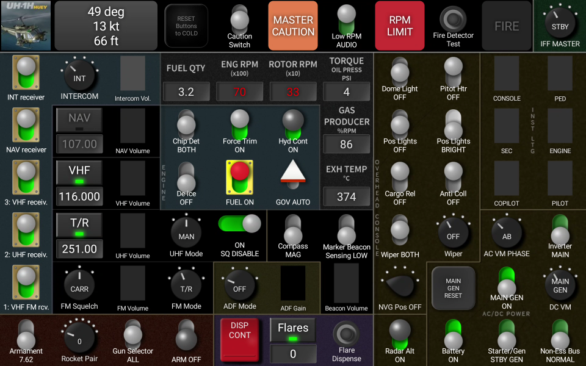

= UH-1H Touch Portal panel

* Page to import: https://github.com/virgo47/dcs-files/raw/main/touch-portal-panels/pages/dcs-uh1h-page.tpz2[dcs-uh1h-page.tpz2]

Remote links:

* DCS user file: https://www.digitalcombatsimulator.com/en/files/3342493/[DCS-COINS: UH-1H Dashboard]
* Forum comment: https://forum.dcs.world/topic/207264-touch-portal-app/page/20/#comment-5562421

The page:

== User file info

* Name: +
DCS-COINS: UH-1H Huey Dashboard

* Summary:
+
....
UH-1H control "panel" for Touch Portal Android application, powered by DCS-COINS plugin.
....

* Description:
+
....
License/conditions:
- The dashboard itself and original icons are distributed under Unlicense: https://en.wikipedia.org/wiki/Unlicense

Requirements:
- DCS-COINS: https://www.digitalcombatsimulator.com/en/files/3319022/
- Touch Portal 4.3: https://www.touch-portal.com/
- Touch Portal on Android requires a paid Pro Upgrade (~14 USD)

Installation:
- DCS-COINS and Touch Portal must be already installed and working.
- Download and extract the file.
- In Touch Portal go to the Pages tab, click the cog wheel next to the page selector and choose "Import page..."
- Select the file dcs-uh1h-page.tpz2 and click "Open".
- Navigate the following dialogs, there should be no problems on the first import.
- NOTE: Repeated imports will ask about the conflicting values, DO NOT add them as new assets. Currently, TP does not have an option to choose "Do not import" for all the existing values, it's probably faster to remove the `dcs-uh1h-*` values first.

Description:
- The panel covers the following cockpit sections:
-- Top row: Warning/caution lights (top of the instrument panel) and related switches (from caution panel), and IFF master knob.
-- Left part: Intercom, radios, and navigation, including volume sliders.
Brassy switches are the intercom switches (originally in row), #4 is missing as it has no use.
I believe you can figure out the rest.
-- Central part: Indicators for 6 most important gauges, including color changes depending on the value range, arranged in reverse L shape.
Inside this are engine related switches (governor, fuel, de-ice), and misc control panel switches (hyd cont, force trim and chip detector) - all from the central pedestal.
-- Lower central part is a mix of compass and marker beacon sensing switches, and marker beacon volume, and ADF mode and gain.
-- Bottom part from the right contains armament controls, and countermeasures controls.
Note that Flare Dispense switch is momentary, but toggles in this panel - this releases the flare every other second. (You likely have this on HOTAS binding anyway, so use that for momentary action.)
Disp-Cont releases all the flares rapidly, but you need to tap it twice - to open the cover first. You can't close the cover from the panel, you have to do it in the actual in-game cockpit.
-- Finally, the four right columns mirror the overhead console pretty much exactly.
The Main-Gen switch is split to two elements, the left square button doing the reset.
- The panel default values are prepared for the cold setup, use the auxiliary RESET button in the top row to switch the panel switches to the "hot" setup. This does not change anything in DCS, only the Touch Portal button states.
- Heading is true, speed is IAS (but not affected by the downwash, unlike the Airspeed indicator), altitude is MSL.

Known issues:
- Sliders don't update when you move the knobs in the cockpit. This is a known TP/COINS limitation.
- One of the volumes goes upside-down, but this should be fixed by the next DCS-COINS update.

Note that there is also UH-1H Dashboard by Munt.G: https://www.digitalcombatsimulator.com/en/files/3320621/
This dashboard is more cramped, containing also various sliders for knobs like light intensity, volumes, etc.

Source repository: https://github.com/virgo47/dcs-files/tree/main/touch-portal-panels

History:
- 2024-12-08: Initial version published
....

* Tags: +
Touch Portal, DCS-COINS, UH-1H, Huey, control panel, dashboard, Android

// == Other notes
